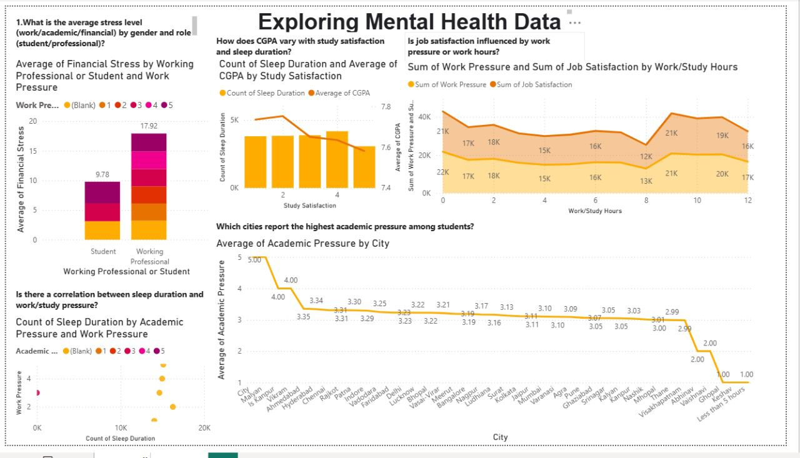
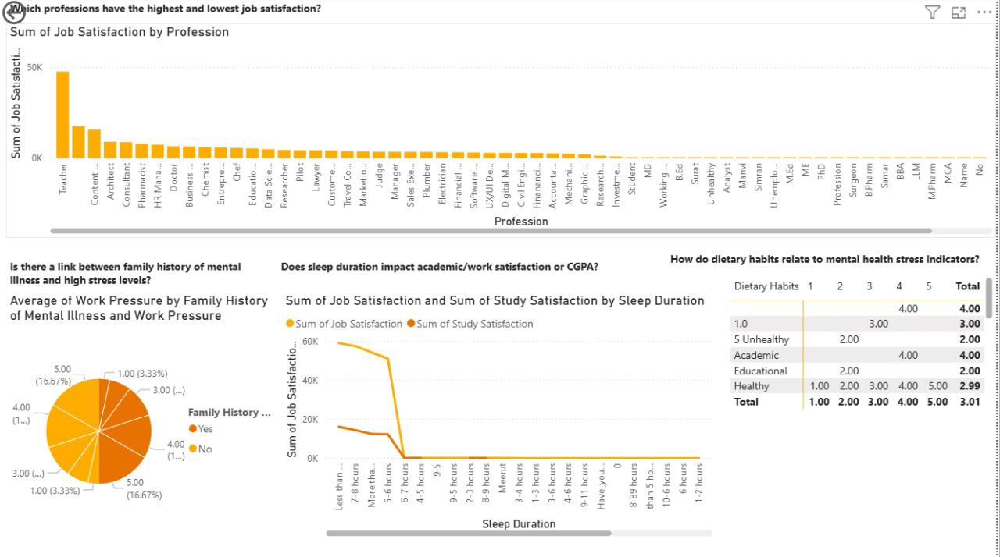

**Exploring Mental Health Data**

🧠 Exploring Mental Health Data
Mental Health Insights Dashboard (Power BI)
This project presents an interactive Power BI dashboard that explores mental health data collected through surveys. The dashboard provides valuable insights into mental health prevalence, workplace support, and demographic trends, with a focus on tech industry professionals.

📊 Features
->Mental Health Prevalence: Overview of the percentage of respondents who reported mental health issues.

->Workplace Support Analysis: Breakdown of employer-provided mental health benefits and workplace attitudes.

->Demographic Insights: Visualization of mental health trends by age, gender, country, and role.

->Treatment Seeking Behavior: Analysis of how many individuals sought treatment and the factors influencing that decision.

->Interactive Filters: Drill down by region, company size, gender, and other filters for customized exploration.

📷 Screenshots
Here are some visuals from the dashboard:

Dashboard Overview

🛠️ Built With
Power BI Desktop – Data visualization and dashboard design
.pbix File – Exploring Mental Health Data.pbix included for review and editing
🛠 How to Use This Project
Download the .pbix file from this repository.
Open it using Power BI Desktop (you can download it from the Power BI website).
View and explore the dashboard.
You can filter the data, edit visuals, or add your own data if you want.

🧑‍💻 Author
This project is created by Tanisha Madisetty.
Feel free to check out my other work or connect with me!

